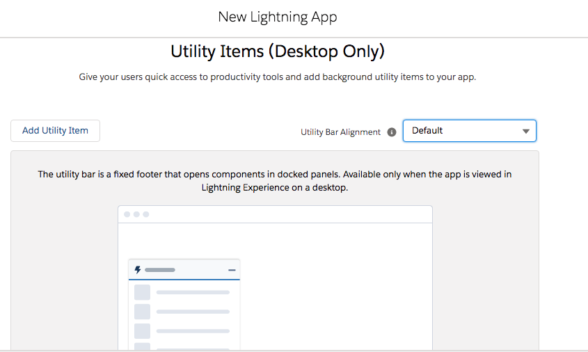
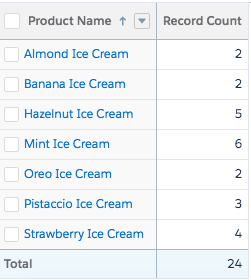

# BUSINESS CASE

The Ice cream company requires a solution where the customer can order ice cream (minimum 1 scoop) and an unlimited number of scoops in a dynamic manner. Customers should also be able to select the toppings, sprinkles and whether they would like to include a Waffer. The solution should also allow to automatically calculate the total price.

<u> Reports </u>

Ice selling history grouped by day.

<u> Dashboard </u>

- Ice cream selling history grouped by days.
- Top 5 flavours sold.

<u> Custom Homepage </u>

When users log onto Salesforce on their homepage the data from the reports should be displayed on the homepage with visual charts. It should also allow users to show recent records.

# MY SOLUTION

## Step 1 - DETERMINE OBJECT USAGE

The solution was developed on the dev org instance [https://eu40.lightning.force.com/] (https://eu40.lightning.force.com/)

The first step during the process would be to ask yourself which standard objects can be used that would fulfill the requirements so this is what i came up with:

### CONTACTS

This will be used to register new and existing customers that want to order.

### OPPORTUNITIES

This will be used to register the sales of ice cream products.

### PRODUCTS

Goes without saying this would be required to register each ice cream flavour and toppings.

### PRICE BOOKS

We will be using only 1 price book as this Business Model only tragets individual customers, here we will be adding price per unit for ice cream and toppings.

## Step 2 - DEFINING THE AVAILABLE PRODUCTS

we search for Products object by going to the app launcher at the top left of the org

We then search for products

We should now see the products page clicking on the new button will allow us to start adding new products

We insert each product until all products have been added to the system. Adding new products by clicking **save & new** and clicking on **save** when we have decided its the last product.

product code naming convention starts with ice-001 where the last 3 digits increments +1

## Step 3 - INSERT THE PRODUCTS INTO THE PRICE BOOK

We click on one of the products that we would like to add to a price book & select the related tab.

We then click on Add to Price Book button on the top right.

We select the price book & currency

**NB: At the time of building the project an error was made in creating additional price books when the standard one was sufficient however the process is exactly the same**

The price book entry window box appears, ensure that its active and save. We do this for every product we need added to the price book.

## Step 4 - VERIFY PRODUCTS HAVE ADDED TO THE PRICE BOOK

Within our applauncher we now search for price books

We are then taken to the main page of price books where we are shown the standard Price Book which is the default price book. We will not be required to insert additional price books as our base target is individual customers where we will have one dedicated fixed price.

Click on the price book

Go to the related tab

You will now see all product entries for the price book.

## Step 5 - CREATING THE CUSTOM HOMEPAGE

We need to access the backend of Salesforce, this can be done by clicking the gear icon on the top right part of the salesforce interface. We then need to select setup

In the quick find search option below the app launcher we search for lightning app builder

This brings us to the main screen we click on the new button.

We should then see a dialogue box we select Home Page then click on next.

We then move to the page where we give it a label, type the text  in the label box then click on next.

We now will chose the layout of the page, we are going to stick with the header and three regions. Based on our requirements we can always change it at a later stage, click on finish.

Next we chose the components from the left pane we select Dashboard, report charts & recent items

## Step 6 - BUILDING THE ICE CREAM VENDING APPLICATION

I took the decision that for this requirement an application would make sense as there will be several objects involved, in order to develop the application we would need to use App Manager.

Within the quick find we need to look for app manager

Next we need to select New lightning App

Define the app name, description, we can also specify a different image as the logo for the app an click next

for the App options leave the defaults and click next

We are next confronted with the utility items we are going to leave the defaults and click on next

Next screen **Navigation Items** provides us the option to add the objects that should be part of the application we will place them in the following order:

- Ice Cream Vending (Being the home page we built)
- Contacts
- Opportunities
- Products
- Price Books
- Reports
- Dashboards

Next we will select which user profiles will have access to the application, we will select Sales & System Administrator then click on Save & Finish

You return to the previous screen, Ice cream orders app is displayed in the list of apps

## Step 7 - REPORTING

Selling activity on a daily basis grouped by day and sorted by the number of scoops sold.

It was decided to use Opportunities with Products report type as you can see a matrix style report was used filtered by row as closed date and column as quantity

clicking the chart icon on the top right next to save and run provides us with a chart. This is required in order to display the chart data from the report on the user customized home page.

## Step 8 - DASHBOARD

The dashboard is a replica of whats contained in our reports

